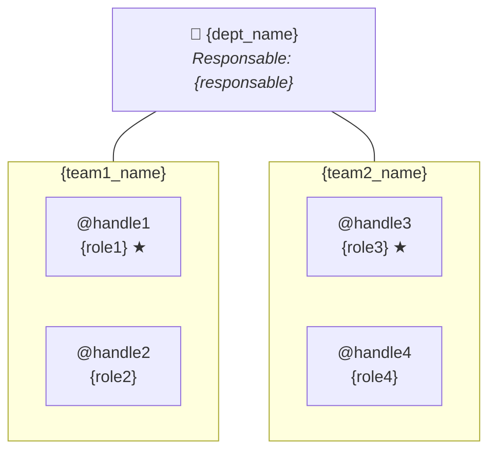
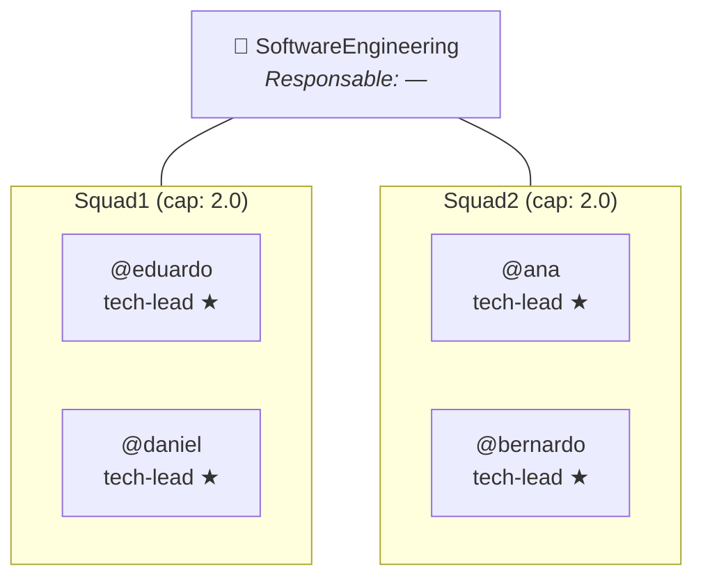

# Orgchart Mermaid Template

> Plantilla para generar organigramas con `graph TB` y subgraphs por equipo.

## Convenciones

- Nodo raíz: departamento con responsable (si existe)
- Subgraph por equipo: nombre del equipo como título
- Leads: sufijo ` ★` y rol como subtítulo
- Miembros: @handle con rol como subtítulo
- IDs de nodo: `DEPT`, `SQ_{team}_{handle}` (sin @, sin guiones)

## Plantilla base

## Reglas de generación

1. Leer `teams/{dept}/dept.md` para nombre y responsable
2. Leer `teams/{dept}/{team}/team.md` para cada equipo
3. Miembros con rol en `lead:` llevan ★
4. IDs sin caracteres especiales: `@ana` → `SQ_T1_ana`
5. Solo usar @handles, NUNCA nombres reales (regla PII-Free)
6. Capacity total del equipo se muestra en el subgraph title si >0

## Ejemplo real (SoftwareEngineering)

