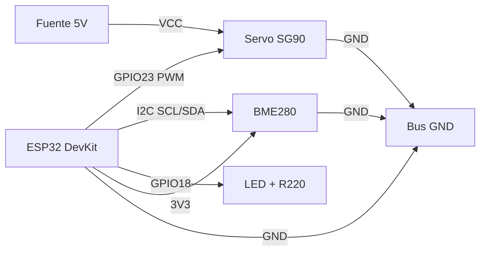

# SPEC-005: Guiado de ensamblaje físico — Savia guía al humano

> Status: **DRAFT** · Fecha: 2026-03-21
> Problema: Savia sabe qué conectar pero el humano necesita ver CÓMO

---

## Problema

Savia puede diseñar circuitos, elegir componentes y generar código
para microcontroladores. Pero hay un gap: el humano tiene que
conectar cables físicamente, soldar, y verificar conexiones. Hoy
eso requiere buscar tutoriales externos. Savia debería poder guiar
todo el proceso.

## Solución: 3 modalidades de guiado

```
┌─────────────────────────────────────────────────┐
│  MODO 1 — Diagramas de conexión (visual)        │
│  ASCII art + SVG generado + Mermaid pinout       │
│  → Para pantalla de ordenador o tablet           │
├─────────────────────────────────────────────────┤
│  MODO 2 — Manual paso a paso (texto)            │
│  Instrucciones numeradas con verificación        │
│  → Para leer en el móvil junto al banco          │
├─────────────────────────────────────────────────┤
│  MODO 3 — Guía por voz (TTS)                    │
│  pyttsx3 offline, paso a paso con pausas         │
│  → Manos libres mientras se suelda/cablea       │
└─────────────────────────────────────────────────┘
```

---

## Modo 1: Diagramas de conexión

### ASCII Pinout (siempre disponible, zero deps)

```
    ┌──────────────┐
    │   ESP32       │
    │              │
3V3 ┤ 1        38 ├ GND
 EN ┤ 2        37 ├ GPIO23 ──── Servo Signal (naranja)
G36 ┤ 3        36 ├ GPIO22 ──── I2C SCL (amarillo)
G39 ┤ 4        35 ├ GPIO1
G34 ┤ 5        34 ├ GPIO3
G35 ┤ 6        33 ├ GPIO21 ──── I2C SDA (azul)
G32 ┤ 7        32 ├ GND
G33 ┤ 8        31 ├ GPIO19
G25 ┤ 9        30 ├ GPIO18 ──── LED (con R220Ω)
G26 ┤ 10       29 ├ GPIO5
G27 ┤ 11       28 ├ GPIO17
G14 ┤ 12       27 ├ GPIO16
G12 ┤ 13       26 ├ GPIO4
GND ┤ 14       25 ├ GPIO2  ──── LED integrado
G13 ┤ 15       24 ├ GPIO15
    │              │
5V  ┤ VIN    3V3  ├ 3V3 ──── Sensor VCC (rojo)
    └──────────────┘

Conexiones:
  ESP32 GPIO23 → Servo signal (cable naranja)
  ESP32 GPIO22 → Sensor SCL (cable amarillo)
  ESP32 GPIO21 → Sensor SDA (cable azul)
  ESP32 3V3    → Sensor VCC (cable rojo)
  ESP32 GND    → Sensor GND + Servo GND (cables negros)
  Servo VCC    → Fuente externa 5V (NO usar 3V3 del ESP32)
```

### Mermaid para diagramas de flujo de señal



### SVG generado (schemdraw)

```python
# Script para generar diagrama de conexiones
import schemdraw
import schemdraw.elements as elm

with schemdraw.Drawing(file='output/wiring-esp32-servo.svg') as d:
    d += elm.Dot().label('ESP32\nGPIO23', loc='left')
    d += elm.Line().right().length(2).label('Signal', loc='top')
    d += elm.Dot().label('Servo\nSG90', loc='right')
```

---

## Modo 2: Manual paso a paso

### Formato estándar por paso

```markdown
## Paso 3 de 8: Conectar el sensor BME280

### Qué necesitas
- 4 cables Dupont hembra-hembra (rojo, negro, amarillo, azul)
- Sensor BME280 (el que tiene 4 pines: VCC, GND, SCL, SDA)

### Conexiones
1. Cable ROJO: ESP32 pin 3V3 → Sensor pin VCC
2. Cable NEGRO: ESP32 pin GND → Sensor pin GND
3. Cable AMARILLO: ESP32 pin GPIO22 → Sensor pin SCL
4. Cable AZUL: ESP32 pin GPIO21 → Sensor pin SDA

### Verificación
- [ ] ¿El LED rojo del sensor se enciende?
- [ ] ¿Los cables están firmes (tira suavemente)?
- [ ] ¿No hay cables cruzados entre VCC y GND?

### ⚠️ Seguridad
- NUNCA conectar VCC a 5V — el BME280 funciona a 3.3V
- Si el sensor se calienta, DESCONECTAR inmediatamente

### 📸 Foto de referencia
[Si disponible: output/assembly/step-03-bme280.png]

### Siguiente paso
→ Paso 4: Conectar el servo SG90
```

### Generación del manual

```
/assembly-guide "ESP32 con servo SG90 y sensor BME280"
  → Savia genera BOM (bill of materials)
  → Genera manual de N pasos
  → Genera diagramas ASCII + Mermaid
  → Guarda en output/assembly/{proyecto}/
```

---

## Modo 3: Guía por voz (TTS)

### Stack técnico

```
pyttsx3 (offline, zero deps de red)
  ├── Linux: espeak-ng
  ├── macOS: AVSpeech / NSSpeechSynthesizer
  └── Windows: SAPI5
```

### Flujo de voz

```python
import pyttsx3

engine = pyttsx3.init()
engine.setProperty('rate', 130)     # Velocidad lenta para seguir
engine.setProperty('volume', 0.9)

steps = [
    "Paso 1. Coloca el ESP32 en la breadboard, con el puerto USB "
    "mirando hacia ti.",
    "Paso 2. Coge un cable rojo. Conecta el pin 3 V 3 del ESP32 "
    "al rail positivo de la breadboard.",
    "Paso 3. Coge un cable negro. Conecta el pin G N D del ESP32 "
    "al rail negativo de la breadboard.",
    # ...
]

for i, step in enumerate(steps):
    engine.say(step)
    engine.runAndWait()
    input(f"  [Enter para continuar al paso {i+2}...]")
```

### Comandos de voz durante ensamblaje

```
/assembly-voice start    → Inicia guía por voz
/assembly-voice pause    → Pausa
/assembly-voice repeat   → Repite último paso
/assembly-voice next     → Siguiente paso
/assembly-voice stop     → Detiene
/assembly-voice status   → "Estás en el paso 4 de 8"
```

---

## Componentes a implementar

### 1. Generador de pinout ASCII (`scripts/robotics/pinout.py`)

Librería de pinouts para MCUs comunes:
- ESP32 DevKit V1 (38 pines)
- ESP32-S3 (44 pines)
- Arduino Uno (28 pines)
- Raspberry Pi Pico / RP2040 (40 pines)
- STM32 Blue Pill (40 pines)

Input: lista de conexiones `[{mcu_pin, device, device_pin, color}]`
Output: ASCII art con conexiones marcadas

### 2. Generador de manual (`scripts/robotics/assembly_guide.py`)

Input: spec del proyecto (componentes + conexiones)
Output: manual paso a paso en markdown con:
- BOM con links de compra (genéricos)
- Pasos numerados con verificación
- Advertencias de seguridad por componente
- Diagramas ASCII inline

### 3. Motor de voz (`scripts/robotics/voice_guide.py`)

Input: manual generado (lista de pasos)
Output: narración por voz con pausas interactivas
Deps: pyttsx3 (pip install pyttsx3)

### 4. Comando `/assembly-guide`

```
/assembly-guide "ESP32 con servo y sensor"  → manual + diagrama
/assembly-guide --voice                     → modo voz
/assembly-guide --bom-only                  → solo lista de materiales
/assembly-guide --verify                    → checklist de verificación
```

---

## Base de conocimiento de componentes

### Sensores comunes

| Componente | Protocolo | Voltaje | Pines |
|-----------|-----------|---------|-------|
| BME280 | I2C | 3.3V | VCC, GND, SCL, SDA |
| MPU6050 (IMU) | I2C | 3.3V | VCC, GND, SCL, SDA, INT |
| HC-SR04 (ultrasonido) | GPIO | 5V | VCC, GND, TRIG, ECHO |
| VL53L0X (LIDAR) | I2C | 3.3V | VCC, GND, SCL, SDA |
| DHT22 (temp/hum) | OneWire | 3.3-5V | VCC, GND, DATA |

### Actuadores comunes

| Componente | Control | Voltaje | Notas |
|-----------|---------|---------|-------|
| Servo SG90 | PWM | 5V ext | NUNCA alimentar desde 3V3 |
| Motor DC + L298N | PWM + DIR | 5-12V | Diodo flyback incluido |
| Stepper 28BYJ-48 | ULN2003 | 5V | 4 fases, baja velocidad |
| Relay 5V | GPIO | 5V | Aislamiento optoacoplador |

### Advertencias por componente

```yaml
servo_sg90:
  warning: "NUNCA alimentar desde el pin 3V3 del ESP32. Usar fuente
           externa de 5V. El servo puede drenar >500mA en carga."
  color_code: "Naranja=signal, Rojo=VCC(5V), Marrón=GND"

relay_5v:
  warning: "PELIGRO si controla AC 220V. Verificar aislamiento.
           NUNCA tocar terminales del relay con corriente AC."
  safety_level: "critical"
```

---

## Roadmap de implementación

### Fase A — ASCII pinouts + manual texto (1 sesión)

- [ ] `scripts/robotics/pinout.py` con ESP32 DevKit
- [ ] `scripts/robotics/assembly_guide.py` generador de pasos
- [ ] `/assembly-guide` comando básico
- [ ] Base de conocimiento: 5 sensores + 4 actuadores

### Fase B — Voz offline (1 sesión)

- [ ] `scripts/robotics/voice_guide.py` con pyttsx3
- [ ] `/assembly-voice` comando con start/pause/repeat/next
- [ ] Velocidad adaptativa (más lento en pasos complejos)
- [ ] Soporte ES/EN según perfil de usuario

### Fase C — Diagramas SVG + Mermaid (1 sesión)

- [ ] Generación SVG con schemdraw (opcional, si instalado)
- [ ] Mermaid para diagramas de flujo de señal
- [ ] Export a PDF para imprimir

### Fase D — Verificación interactiva (futuro)

- [ ] Checklist post-conexión ejecutable
- [ ] Test de continuidad via ESP32 (pines de test)
- [ ] Foto-verificación con Claude Vision
